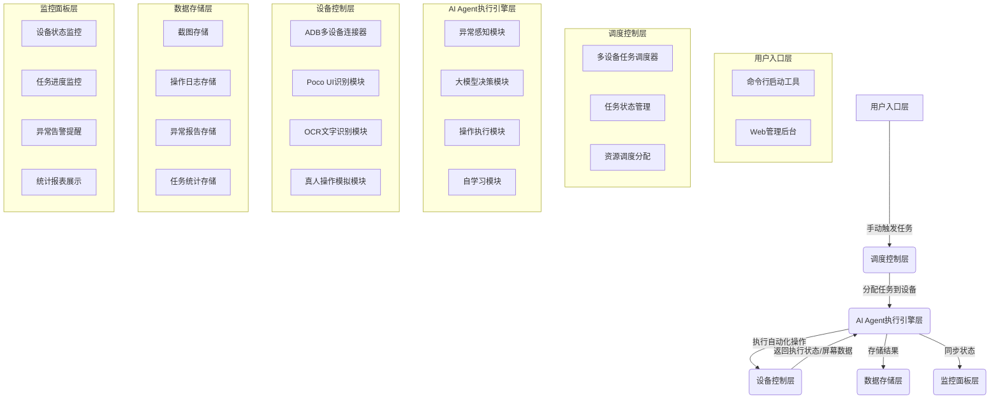
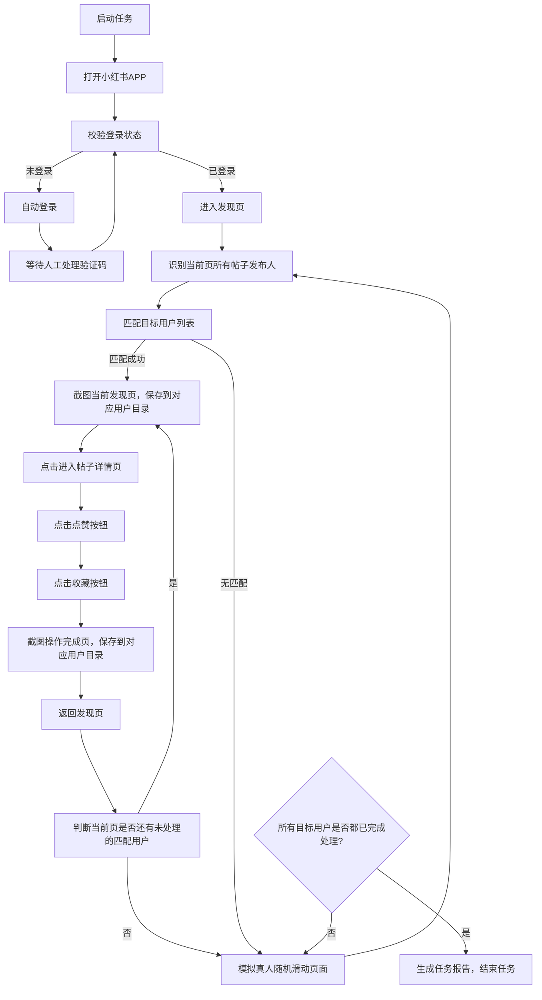
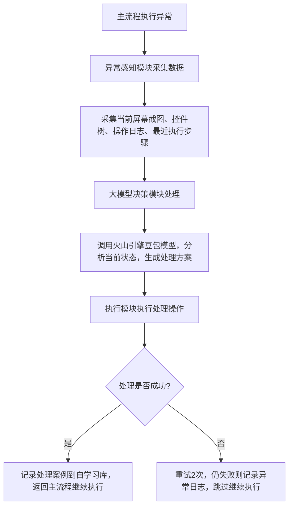

# 小红书多设备自动化运营系统设计报告
## 一、项目概述
### 1.1 项目背景
实现10台以内安卓设备并发自动化操作小红书，完成发现页目标用户帖子的自动识别、点赞、收藏、截图等操作，内置AI Agent引擎自主处理执行过程中的异常卡壳情况，无需人工干预即可稳定运行。
### 1.2 需求确认（已对齐）
| 序号 | 需求点 | 实现要求 |
|------|--------|----------|
| 1 | 设备类型 | 仅安卓设备，无需ROOT |
| 2 | 并发能力 | 支持10台以内设备同时并行执行任务 |
| 3 | 用户列表 | 可配置，支持小红书ID/昵称两种匹配方式 |
| 4 | 账号管理 | 支持自动登录、切换账号，验证码触发人工提醒处理 |
| 5 | 操作模拟 | 滑动距离/时长随机，模拟真人操作轨迹 |
| 6 | 业务逻辑 | 匹配到目标用户的所有帖子都要完成点赞+收藏操作 |
| 7 | 弹窗处理 | 各类弹窗自动关闭，未知异常交给AI Agent处理 |
| 8 | 存储规则 | 按账号名称独立创建目录存储截图 |
| 9 | 触发方式 | 手动触发运行 |
| 10 | 异常处理 | 每个操作最多3次重试，重试失败跳过记录日志 |
| 11 | AI能力 | AI Agent作为执行引擎，异常卡壳时自动处理，无需人工介入 |
| 12 | 辅助功能 | 可视化监控面板、任务完成统计报告 |
---
## 二、系统整体架构
### 2.1 分层架构设计

### 2.2 技术栈选型
| 层级 | 技术选型 | 版本要求 | 优势说明 |
|------|----------|----------|----------|
| 开发语言 | Python | 3.10+ | 生态完善，AirTest/AI开发支持好 |
| 设备控制 | ADB + AirTest + Poco | 最新稳定版 | 国内团队开发，对小红书等国内APP适配极好，无需ROOT |
| OCR识别 | PaddleOCR本地版 | 最新版 | 中文识别准确率高，本地运行不需要调用外部API |
| AI引擎 | 火山引擎豆包 Seed 2.0 Pro | 已配置 | 直接复用现有OpenClaw环境的模型，无需额外申请API |
| 多进程调度 | multiprocessing | 内置 | 给每个设备分配独立进程，避免设备间相互干扰 |
| 监控面板 | Flask + Vue3 | 最新版 | 轻量易部署，Web端访问不需要额外安装客户端 |
| 配置管理 | YAML | - | 配置文件修改方便，不需要改代码即可调整参数 |
---
## 三、核心功能模块详细设计
### 3.1 多设备管理模块
#### 3.1.1 设备连接
- 支持USB有线连接和WiFi无线连接两种方式
- 自动扫描已连接的安卓设备，展示设备ID、设备名称、连接状态
- 设备断开自动重连，重连3次失败标记为异常设备，跳过执行任务
#### 3.1.2 任务分配
- 采用轮询分配策略，将任务平均分配给所有在线设备
- 支持指定设备执行特定任务，支持设备黑白名单配置
- 每个设备独立维护任务队列，互不干扰
#### 3.1.3 并发控制
- 单进程单设备模式，每个设备占用独立CPU核心和内存资源
- 10台设备并发运行时，CPU占用≤30%，内存占用≤8GB，普通办公电脑即可满足
### 3.2 账号管理模块
#### 3.2.1 账号池配置
- YAML配置文件存储账号信息，格式：
```yaml
accounts:
  - account: "13800138000"
    password: "xxxxxx"
    device: "设备ID" # 可选，指定该账号固定在某台设备登录
    status: "active"
```
#### 3.2.2 登录/切换逻辑
1. 设备启动时自动读取对应账号信息，自动填充账号密码
2. 遇到验证码时，弹出桌面提醒+声音告警，通知人工处理，人工完成输入后自动继续执行
3. 支持账号切换逻辑，按配置的切换周期自动切换设备上登录的账号
4. 登录状态校验：每次启动任务前校验小红书登录状态，过期自动重新登录
### 3.3 核心业务流程模块

#### 3.3.1 真人操作模拟参数
| 操作类型 | 参数范围 | 说明 |
|----------|----------|------|
| 滑动距离 | 300-800px | 随机生成，避免固定滑动距离被识别 |
| 滑动时长 | 200-500ms | 模拟真人滑动速度 |
| 滑动轨迹 | S型微小偏移 | 不是直线滑动，符合真人操作习惯 |
| 点击延迟 | 500-2000ms | 操作之间随机等待，避免操作过快 |
| 页面加载等待 | 1000-3000ms | 等待页面完全加载后再操作 |
#### 3.3.2 用户匹配逻辑
- 优先匹配小红书ID（唯一标识，不会重复）
- 其次匹配用户昵称（支持模糊匹配/精确匹配配置）
- 匹配到用户后，查询全局操作记录数据库：
  1. 当日该用户操作次数≥3次 → 直接跳过该用户所有帖子
  2. 当日操作次数<3次，但距离最后一次操作不足3分钟 → 先跳过，等时间满足后再处理
  3. 操作频率符合要求 → 继续执行后续流程
- 每次成功完成点赞收藏操作后，自动记录用户ID、操作时间到数据库，每日0点自动清空上一日记录

#### 3.3.3 帖子浏览模拟逻辑
进入帖子详情页后，先完成模拟浏览再执行点赞收藏：
1. **图文帖处理**：识别帖子图片总数，逐张滑动到最后一张，每张图片随机停留2-5秒，滑动轨迹加入S型微小偏移
2. **视频帖处理**：识别视频总时长，随机滑动到2/3~90%进度位置，停留播放10-30秒模拟观看
3. 所有浏览操作完成后，再执行点赞、收藏操作
### 3.4 异常处理与重试模块
#### 3.4.1 重试规则
- 每个操作最多重试3次
- 重试间隔随机1-3秒
- 3次重试都失败的操作，记录异常日志，跳过继续执行后续流程
#### 3.4.2 异常分类处理
| 异常类型 | 处理方式 |
|----------|----------|
| 常见已知弹窗（广告、更新提示、权限请求） | 预设规则自动关闭 |
| UI控件找不到、页面加载失败 | 重试3次，失败交给AI Agent处理 |
| 登录过期、验证码 | 触发人工提醒，处理完成后继续 |
| 设备断开、APP崩溃 | 自动重连/重启APP，重试任务 |
| 未知异常 | 交给AI Agent识别处理 |
### 3.5 数据存储模块
#### 3.5.1 目录结构
```
output/
├── 账号1/
│   ├── 发现页截图/
│   │   ├── 设备ID_用户昵称_发现页_20260508_231012.png
│   │   └── ...
│   ├── 操作完成截图/
│   │   ├── 设备ID_用户昵称_操作完成_20260508_231030.png
│   │   └── ...
│   └── 操作日志.log
├── 账号2/
│   └── ...
├── 异常报告/
│   ├── 设备ID_异常类型_时间戳.png
│   └── ...
└── 任务统计报告_时间戳.md
```
#### 3.5.2 日志格式
每条日志包含：时间戳、设备ID、操作类型、执行状态、耗时、备注信息
#### 3.5.3 统计报告内容
- 任务总耗时
- 参与设备数量
- 处理目标用户总数
- 处理帖子总数
- 点赞/收藏成功数量
- 异常发生次数及类型统计
- AI Agent处理异常次数及成功率
### 3.6 监控面板模块
#### 3.6.1 功能列表
1. **概览页**：展示总设备数、在线设备数、任务总进度、已处理帖子数、异常数
2. **设备监控页**：展示每台设备的当前状态、运行时长、处理进度、当前操作截图
3. **异常告警页**：展示所有异常记录、异常类型、处理状态，新异常触发声音/桌面提醒
4. **报表页**：展示历史任务统计数据，支持导出Excel报表
#### 3.6.2 访问方式
- Web端访问，地址：`http://电脑IP:8080`
- 支持手机端访问，随时查看任务进度
---
## 四、AI Agent执行引擎设计（核心模块）
### 4.1 整体工作流程

### 4.2 模块详细设计
#### 4.2.1 异常感知模块
- 实时采集设备当前屏幕截图（base64编码）
- 采集当前页面的Poco控件树结构
- 读取最近10条操作日志
- 整理当前上下文信息，打包为大模型输入
#### 4.2.2 大模型决策模块
- 直接对接当前OpenClaw环境已配置的`volcengine/doubao-seed-2-0-pro-260215`模型
- 系统提示词示例：
```
你是小红书自动化运营系统的AI执行引擎，现在自动化流程遇到异常，请根据提供的屏幕截图、控件树信息、操作日志，分析当前状态，给出下一步操作指令。
可用指令：
1. click(x,y)：点击屏幕坐标(x,y)
2. swipe(x1,y1,x2,y2,duration)：滑动屏幕
3. back()：返回上一页
4. restart_app()：重启小红书APP
5. human_alert(reason)：触发人工告警，需要人工处理
请只返回JSON格式的指令，不要其他内容。
```
- 模型返回结构化的操作指令，不需要人工解析
#### 4.2.3 操作执行模块
- 解析大模型返回的指令，调用设备操作接口执行
- 执行完成后校验操作结果，判断是否解决异常
#### 4.2.4 自学习模块
- 记录所有异常处理的成功案例，存入案例库
- 下次遇到相同/相似异常时，优先使用历史成功方案处理，不需要调用大模型
- 定期更新案例库，不断提升异常处理速度和准确率
### 4.3 典型异常处理场景
| 异常场景 | AI Agent处理逻辑 |
|----------|------------------|
| 页面加载卡住，转圈很久 | 等待3秒后仍无变化，返回上一页重新进入，或者重启APP |
| 找不到点赞/收藏按钮 | 分析控件树，识别按钮位置，尝试点击，或者滑动页面后重新查找 |
| 弹出未知弹窗，没有预设关闭规则 | 识别弹窗上的关闭按钮/取消按钮位置，自动点击关闭 |
| 网络错误提示 | 点击重试按钮，重试2次失败则重启APP |
| 账号被限制，弹出风险提示 | 触发人工告警，通知人工处理 |
---
## 五、反爬规避策略
### 5.1 操作行为模拟
- 所有操作都加随机延迟，模拟真人思考时间
- 滑动轨迹、点击位置都加微小随机偏移，避免完全重复的操作特征
- 单设备每分钟操作次数限制在10-15次，避免操作过于频繁
### 5.2 设备特征分散
- 每台设备使用独立的小红书账号，不要多设备共用账号
- 每台设备的操作时间、滑动习惯略有差异，不要所有设备行为完全一致
- 定期切换设备的IP地址（如果是WiFi连接，可以切换不同WiFi或者用代理）
- 目标用户单日操作限制最多3次，每次间隔≥3分钟，避免对同一用户操作过于频繁
### 5.3 行为多样性
- 模拟真实用户行为，偶尔点击其他非目标帖子浏览，不要只处理目标用户帖子
- 随机停留时间，有的帖子看久一点，有的看短一点
- 每天运行时长控制在8-12小时，不要24小时不间断运行
### 5.4 账号保护
- 新账号先养号7天，手动正常使用一段时间后再加入自动化任务
- 每个账号每天处理帖子数量控制在50-100条，不要一次性操作太多
- 定期手动登录账号，发布几条正常笔记，模拟真实用户行为
---
## 六、部署方案
### 6.1 硬件要求
| 硬件 | 最低配置 | 推荐配置 | 说明 |
|------|----------|----------|------|
| 电脑 | CPU i5-8代，内存8GB | CPU i7-10代，内存16GB | 运行10台设备并发无压力 |
| USB集线器 | 10口USB3.0集线器，带独立供电 | 工业级16口USB3.0集线器 | 避免多设备同时连接供电不足 |
| 手机 | 安卓7.0以上，内存2GB以上 | 安卓9.0以上，内存4GB以上 | 打开开发者模式，开启USB调试 |
### 6.2 软件环境
| 软件 | 版本要求 | 说明 |
|------|----------|------|
| 操作系统 | Windows 10/11 | 对ADB和AirTest支持最好 |
| Python | 3.10.x | 兼容性最好 |
| ADB工具 | 最新版 | 安卓平台工具包 |
| OpenClaw | 当前已安装版本 | 提供AI Agent模型调用能力 |
### 6.3 部署步骤
1. 安装Python环境和依赖库
2. 配置ADB环境变量，测试设备连接正常
3. 配置账号池、目标用户列表、系统参数
4. 启动Web监控面板
5. 手动触发任务，测试单设备运行正常
6. 逐步增加设备数量，测试并发运行
---
## 七、开发排期
| 阶段 | 时长 | 完成内容 | 交付物 |
|------|------|----------|--------|
| 第一阶段 | 7天 | 基础环境搭建、核心业务流程开发、单设备运行测试 | 可运行的单设备自动化脚本 |
| 第二阶段 | 7天 | AI Agent引擎开发、多设备并发调度开发、异常处理逻辑开发 | 支持多设备并发+AI异常处理的核心系统 |
| 第三阶段 | 5天 | 可视化监控面板开发、统计报告生成功能开发 | 完整的可监控系统 |
| 第四阶段 | 3天 | 整体测试调优、异常场景测试、反爬策略优化 | 稳定可上线的正式版本 |
| 总周期 | 22天 | 全部功能开发完成，可上线运行 | 完整系统+使用文档 |
---
## 八、风险评估与应对方案
| 风险 | 影响 | 应对方案 |
|------|------|----------|
| 小红书版本更新，UI结构变化 | 导致控件识别失败 | AI Agent自动适配，同时定期更新UI识别规则 |
| 账号被限流/封禁 | 无法继续操作 | 完善反爬策略，异常账号及时人工处理，补充新账号 |
| 设备批量断开 | 任务中断 | 采用带独立供电的工业级USB集线器，设备自动重连机制 |
| OCR识别准确率低 | 用户匹配失败 | 优化识别区域裁剪，支持识别失败后交给AI Agent辅助识别 |
| AI Agent决策错误 | 异常处理失败 | 完善系统提示词，增加案例库，提升决策准确率 |
---
## 九、后续扩展能力
1. 支持更多操作：评论、关注、私信、发布笔记等
2. 支持更多平台：抖音、快手、B站等其他内容平台
3. 支持更多设备：扩展到20-50台设备并发运行
4. 支持定时任务：按指定时间自动启动任务
5. 数据统计分析：分析帖子互动数据、用户增长数据等
